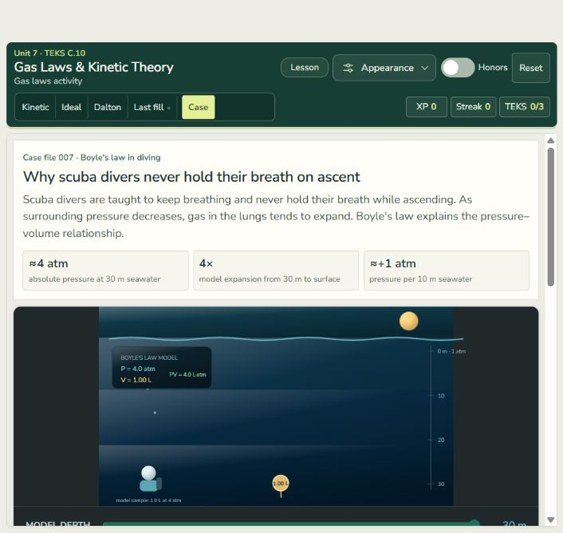
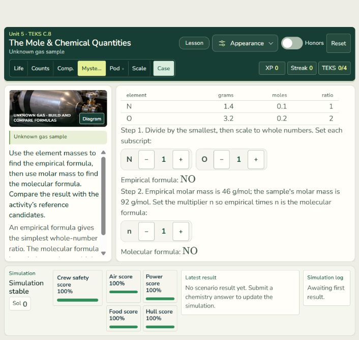
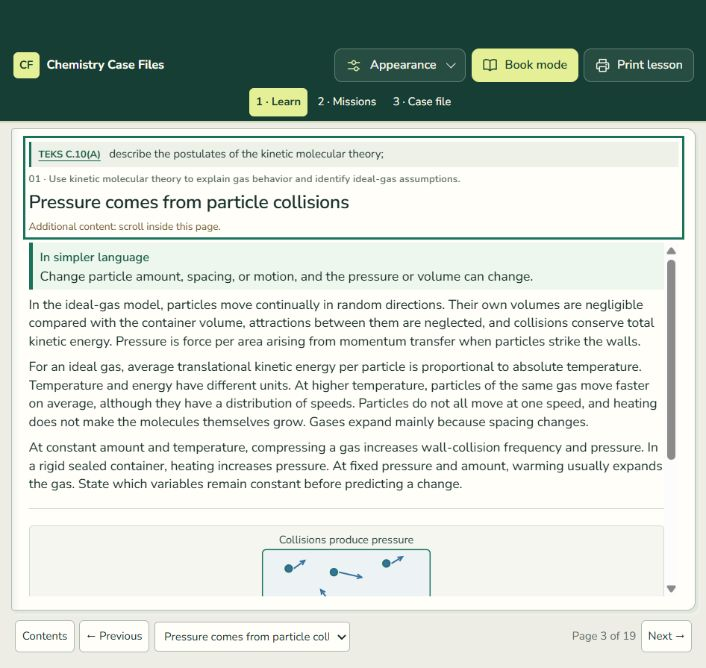

# Nunito Sans course typography

Local verification: September 27, 2026. No commit, push, or deployment.

## Scope

The user's selected Nunito Sans now provides a consistent family across the course home, all eleven readings, and all mission and Case File screens. Prose uses regular weight; controls and headings use restrained medium and semibold weights. Supporting labels have quieter letter spacing and sentence case. Numeric readouts retain tabular figures. Native form controls, SVG labels, and chart labels use the shared family too. KaTeX retains its specialist mathematical glyphs and spacing.

Normal and italic variable WOFF2 subsets are served locally, with the upstream SIL Open Font License beside them. Active pages no longer request the previous Google Fonts families. Shared stylesheet references are versioned to refresh the typography in existing previews.

The existing layout tracks, panel placement, dimensions, spacing, scrolling rules, breakpoints, navigation, illustration geometry, content, and assessment logic are preserved. The font change can naturally alter text wrapping inside those existing containers.

## Verification

| Check | Result |
| --- | --- |
| All 69 primary mission and case tabs across Units 1–11 | Inspected computed typography and page/panel fit; form-control overrides found during the sweep were corrected and rechecked |
| All eleven reading pages | Inspected continuous reading, book cover, and a topic page; consistent Nunito Sans text and no inspected horizontal overflow |
| Course home | Nunito Sans headings, prose, and navigation; no horizontal page overflow |
| Unit 7 mission, case, and book reading at 390 × 844 | No inspected horizontal overflow or remaining text-family overrides |
| Unit 7 reading and Unit 5 formula mission/case at 820 × 1180 | No inspected horizontal overflow or remaining text-family overrides |
| Units 5 and 7 Case Files at 1920 × 900 | Existing three-column layout retained; no inspected horizontal overflow |
| Unit 7 case in Field Lab, Clear, and Atlas | Consistent fonts; correct-answer feedback and chapter 2 preserved through theme changes |
| Keyboard navigation | Answer button received a visible solid focus outline |
| Local font files | Four WOFF2 signatures verified; normal Latin font served successfully by the local preview |
| `npm test` | All existing suites passed |
| `npm run test:lessons` after the final reading-control refinement | Passed |
| `npm run test:site` | Passed: 541 reachable files, 98 scripts parsed, all 392 mission photos |
| `git diff --check -- .` | Passed; existing line-ending normalization warnings only |

Checks used the in-app browser. The fresh `localhost:8079` preview avoided an older cached Unit 2 module response on `127.0.0.1:8079`; the current source required no module changes. Temporary viewport overrides were reset after verification. This is presentation and interaction verification; it does not constitute a new scientific, classroom, or assistive-technology acceptance review.

## Previews

Captured at the browser's normal size. The existing responsive layout determines the visible arrangement.

