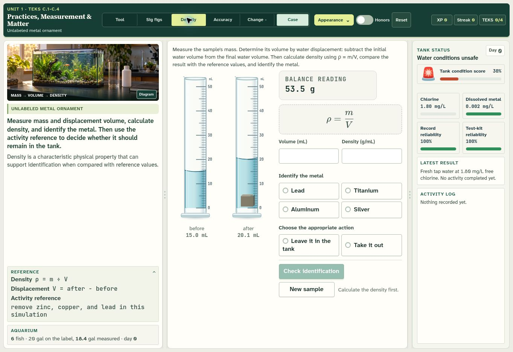

# Field Lab visual refresh

The existing course layout, investigation controls, scientific models, and assessment logic are retained. Field Lab is the new default appearance; saved Clear or Atlas preferences still apply.

- Eleven optimized, generated photographs establish each unit's setting. A twelfth image adds a subtle laboratory backdrop to the course home. Exact prompts are recorded in `shared/assets/photos/provenance.json`.
- All 196 original scenario SVGs remain available. The **Diagram** button reveals the authored scene, **Appearance → Original** restores original artwork throughout the interface, and failed photographs expose the SVG automatically.
- Live graduated cylinders have glass reflections, curved menisci, shaded liquid, and submerged samples. Readings still use the original calibrated geometry. The original cylinder renderer remains available.
- Case File stages retain their paths, text, bindings, chapter states, and animation classes. Optional material shading improves their surfaces. Mars keeps its photographic animation and a complete animated vector fallback.
- **Appearance → Decorative motion → Pause** pauses decorative motion without changing simulation state. Clear and Atlas remain selectable themes.

## Verification

`node --test tests/visual-fidelity.test.mjs` passes all 24 checks. These cover all 501 tenth-milliliter cylinder readings, displacement, unique SVG definitions, usable image files, original-scene retention, and Case File state/geometry preservation across all 11 units. JavaScript syntax checks pass for all 71 source files.

Live browser review covered:

| Viewport | Coverage | Result |
| --- | --- | --- |
| 1366 × 768 laptop | All 11 unit entry screens | No horizontal overflow; mission panels fit |
| 1024 × 768 tablet landscape | Unit 8 | Existing three-column layout fits |
| 820 × 1180 tablet portrait | Unit 8 | Existing responsive arrangement fits |
| 1920 × 1080 desktop | Unit 8 | No horizontal overflow |

Manual checks also covered the course home, live density cylinders, global and per-scene artwork switches, every Mars chapter, pause/resume, and deliberately missing mission and Mars photographs. A missing thermal asset found during review was restored, and the file-size check now rejects empty assets.

The repeatable viewport and missing-image review is available at `tests/visual-review.html`. The photography supplies context; readable scientific values and diagrams remain authored SVG/HTML.

